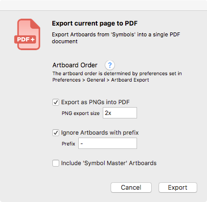

# 📕 PDF Export — Sketch Plugin

A Sketch Plugin to export artboards to a PDF document.

* Export all pages
* Export current page
* Export selected artboards

## Features

#### Export as PNGs into PDF
This will export each artboard first into a PNG, then place those PNGs together into a single PDF document.
This is extremely helpful for things such as 'images with fills', 'gradient fills', 'some shadows' that sometimes don't render well into a PDF.
> You can also specify the export size for the PNGs — same as the typical Sketch export; '200w' = width of 200px, '100h' = height of 100px, '3x' = 3 times artboard size

---

#### Ignore Artboards with prefix
Do you sometimes have those few artboards you still want to keep around, but don't necessarily want to export? Then this is perfect for you.
When checked, you can specify a prefix. Every artboard with that prefix will be excluded when exporting.

---

#### Include 'Symbol Master' Artboards
Based on your use of Sketch, there may be times you want to include your master symbols in the export, and a lot of the time not. Now you have the easy choice.

---

## Why make this plugin?

Too often, I found myself going 'File > Export Artboards to PDF', then opening up the PDF and deleting pages I didn't actually want.

Sometimes I would duplicate a page in Sketch as a new iteration on the design. I would then want to export the single iteration—consisting of multiple artboards—into a PDF for distribution and printing purposes; so having a 'Export current page into PDF' option is a real lifesaver!!

## Installation

1. Download the plugin
2. Double-click the file, 'Nudge Resize.sketchplugin'
3. That's it...

## Contribute

This plugin is in active development.

Pull requests are welcome and please submit bugs 🐛.

## Contact

* Follow [@davidwilliames](https://twitter.com/davidwilliames) on Twitter
* Email <david@williames.com>

---

If you find this plugin helpful, consider shouting me coffee ☕️ via [PayPal](https://www.paypal.me/dtw/5)

